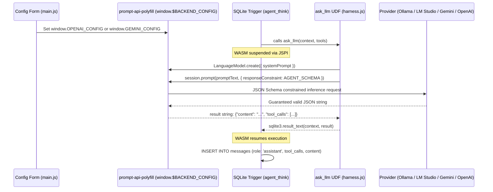

# Implementation Plan: Prompt API Integration & Provider Configuration UI

> **⚠️ SHELVED** — Chrome's native `window.LanguageModel` (Built-In AI) intercepts the polyfill and ignores `OPENAI_CONFIG`/`GEMINI_CONFIG`, routing to Chrome's on-device model instead. ES module import hoisting prevents deleting the native API before polyfill loads. Raw `fetch()` is the reliable transport for arbitrary OpenAI-compatible endpoints. Revisit when Prompt API standard matures or polyfill gains `forcePolyfill` option.

**Goal:** Wire Bobby's LLM transport layer to the **Prompt API** (via `prompt-api-polyfill` / `LanguageModel`) using `responseConstraint` (JSON Schema structured output), and build a clean **Provider Configuration UI** supporting custom OpenAI-compatible endpoints (Ollama, LM Studio, OpenRouter, OpenAI) and Google Gemini API.

---

## 1. Scope Boundaries (Strictly Enforced)

### In Scope for this Milestone:
1. **Prompt API (`prompt-api-polyfill`) Integration:**
   * Install and configure `prompt-api-polyfill` in the frontend bundle.
   * Standardize `ask_llm` in `src/harness.js` around `LanguageModel.create()` and `session.prompt(..., { responseConstraint: AGENT_SCHEMA })`.
   * Guarantee structured `{ content, tool_calls }` output from all connected backends.
2. **Provider Selection & Configuration UI:**
   * **OpenAI-Compatible / Custom Endpoint:** (Default) Base URL input (e.g. `http://localhost:11434/v1`, `http://localhost:1234/v1`, `https://api.openai.com/v1`), Model name, and optional API key.
   * **Google Gemini API:** Model name (default `gemini-2.5-flash`) and Gemini API key.
   * Dynamic form switching (shows URL field for custom endpoints, hides URL field for standard Gemini).
   * Persist config to `localStorage` and `system_config` table in SQLite.

### Explicitly Out of Scope for this Milestone:
* ❌ **Gemini Nano (On-Device Local Model):** Not offered as a selectable UI option per instruction.
* ❌ **3-Pane Workstation Layout / Grid Engine:** Deferred to subsequent tickets after LLM transport is validated.
* ❌ **CSV Drag-and-Drop Ingestion:** Deferred to subsequent tickets.

---

## 2. Technical Architecture



---

## 3. Proposed File Changes

### 1. `package.json`
#### `[MODIFY]` `package.json`
* Add `prompt-api-polyfill` to `dependencies`:
  ```json
  "dependencies": {
    "prompt-api-polyfill": "^0.1.0"
  }
  ```

---

### 2. `src/harness.js`
#### `[MODIFY]` `src/harness.js`
1. **Initialize Backend Config:**
   Dynamically configure `window.OPENAI_CONFIG` or `window.GEMINI_CONFIG` based on the user's saved settings before calling the API:
   ```javascript
   export function setupPromptApiBackend({ provider, url, model, apiKey }) {
     // Clean previous configs
     delete window.OPENAI_CONFIG;
     delete window.GEMINI_CONFIG;

     if (provider === 'gemini') {
       window.GEMINI_CONFIG = {
         apiKey: apiKey,
         modelName: model || 'gemini-2.5-flash',
       };
     } else {
       // 'openai' / custom compatible (Ollama, LM Studio, OpenRouter, OpenAI)
       window.OPENAI_CONFIG = {
         baseURL: url || 'http://localhost:11434/v1',
         modelName: model || 'llama3.2',
         apiKey: apiKey || 'dummy',
       };
     }
   }
   ```

2. **Refactor `ask_llm` to use `LanguageModel`:**
   ```javascript
   const AGENT_RESPONSE_SCHEMA = {
     type: "object",
     properties: {
       content: { type: "string", description: "Response text or thinking to the user" },
       tool_calls: {
         type: "array",
         description: "Tools to execute, or empty if answering directly",
         items: {
           type: "object",
           properties: {
             name: { type: "string", enum: ["execute_sql", "search_web", "fetch_url"] },
             arguments: { type: "object", description: "Tool argument object" }
           },
           required: ["name", "arguments"]
         }
       }
     },
     required: ["content"]
   };

   // Inside ask_llm UDF:
   sqlite3.create_function(db, 'ask_llm', 2, SQLITE_UTF8, null, async (context, args) => {
     try {
       const messagesJson = sqlite3.value_text(args[0]);
       const toolsJson = sqlite3.value_text(args[1]);
       const messages = JSON.parse(messagesJson);
       const tools = JSON.parse(toolsJson);

       // 1. Build prompt string with system instructions & tools description
       const systemPrompt = buildSystemPrompt(tools);
       const session = await LanguageModel.create({ systemPrompt });

       // 2. Call Prompt API with responseConstraint for guaranteed JSON
       const formattedHistory = formatConversation(messages);
       const rawResult = await session.prompt(formattedHistory, {
         responseConstraint: AGENT_RESPONSE_SCHEMA
       });

       // 3. Estimate/extract tokens and return structured JSON to SQLite
       sqlite3.result_text(context, rawResult);
     } catch (e) {
       console.error('[ask_llm]', e);
       sqlite3.result_text(context, JSON.stringify({
         content: `⚠ SYSTEM ERROR: ${e.message}`,
         tool_calls: null
       }));
     }
   });
   ```

---

### 3. `index.html`
#### `[MODIFY]` `index.html`
* Update `#config-panel` to provide clear, intuitive provider selection:
  ```html
  <div class="config-row">
    <label for="config-provider">Provider</label>
    <select id="config-provider">
      <option value="openai">OpenAI Compatible (Ollama, LM Studio, Local, OpenRouter)</option>
      <option value="gemini">Google Gemini API</option>
    </select>
  </div>
  <div class="config-row" id="row-config-url">
    <label for="config-url">Base URL / Endpoint</label>
    <input type="text" id="config-url" placeholder="http://localhost:11434/v1" />
    <small class="hint">Ollama: http://localhost:11434/v1 &middot; LM Studio: http://localhost:1234/v1</small>
  </div>
  <div class="config-row">
    <label for="config-model">Model Name</label>
    <input type="text" id="config-model" placeholder="llama3.2 or gemini-2.5-flash" />
  </div>
  <div class="config-row">
    <label for="config-key">API Key <span class="optional">(optional for local Ollama/LM Studio)</span></label>
    <input type="password" id="config-key" placeholder="AIza... or sk-..." />
  </div>
  ```

---

### 4. `src/main.js` & `src/styles.css`
#### `[MODIFY]` `src/main.js`
* Listen to `configProvider` change event:
  * When `openai` is selected: show the Base URL row, set placeholder to `http://localhost:11434/v1` and model to `llama3.2`.
  * When `gemini` is selected: hide the Base URL row (Gemini uses standard cloud SDK endpoint), set model to `gemini-2.5-flash`, require API key.
* Call `setupPromptApiBackend(config)` on boot and on form submit.
* Update status bar to display: `● Ready — OpenAI Compatible at http://localhost:11434/v1 (llama3.2)` or `● Ready — Google Gemini (gemini-2.5-flash)`.

---

## 4. Verification Plan

### Automated Verification
* `npm install` and `npm run build` to verify clean compilation with Vite.

### Manual Verification
1. **Ollama / Local Endpoint Test:**
   * Select "OpenAI Compatible".
   * Set URL to `http://localhost:11434/v1`, model to `llama3.2` (or your local model).
   * Leave API key blank.
   * Send: `"What products are in the sample_data table?"`
   * **Expected:** Bobby calls `execute_sql('SELECT * FROM sample_data')` via structured JSON output, receives rows, and answers correctly.
2. **Google Gemini API Test:**
   * Select "Google Gemini API".
   * Enter Gemini API key, model `gemini-2.5-flash`.
   * Send a query $\rightarrow$ verify ReAct cascade completes and renders answer in chat.
3. **UI Switching Test:**
   * Switch between Gemini and OpenAI in the dropdown $\rightarrow$ verify URL field hides/shows and placeholders adjust appropriately.
