# Wayfinder Map: Bobby (Web SQL Agent)

**Map Label:** `wayfinder:map`  
**Status:** Charted & Active  
**Issue Tracker Mode:** Local Markdown  

---

## Destination

A production-ready, local-first **Pure-SQL Web Agent & Data Operating System** running in the browser on SQLite WASM + JSPI. It features a **3-Pane Workstation** (Left: DB Explorer & Schema Inspector, Center: Chat & SQL Scratchpad, Right: Live 3x3 Reactive Grid), enabling multi-session conversational data analysis, drag-and-drop query pinning, 20-turn rolling state rewinds, CSV ingestion, in-browser vector & full-text search (`sqlite-vec` / `fts5`), declutter-compressed context views, direct SQL execution (`!query`), and exportable `.sqlite3` cartridges.

---

## Notes

* **Core Philosophy:** *Push everything into SQLite.* The host JavaScript is strictly an I/O bridge; the ReAct state machine, history, tools, dashboard state, approvals, and memory management live in SQL triggers and tables.
* **Execution Stack:** `wa-sqlite` + WebAssembly JSPI (JavaScript Promise Integration) for zero-overhead async UDF suspension.
* **Relevant Skills & References:** `/grilling`, `/domain-modeling`, `/research`, `huggingface/tau` reference architecture.
* **AGY as coding partner (standing preference, 2026-08-14):** Deploy AGY (`agy-wrapper.sh`) as a second set of eyes for sticky or non-apparent problems — implementation cross-checks, review of tricky glue code (JSPI/wasm boundaries, VFS behavior), and independent verification of empirically-probed facts. Check quota with `check-usage` before spawning; default to `Gemini 3.7 Flash (Low)`.

---

## Operating Notes (session handoff)

A fresh session resumes from **this map alone** — destination, philosophy, and standing preferences are above. These are the operational facts that otherwise live only in a working session's head:

* **One session = one ticket.** Claim it (mark 🟡 in-progress with a "Next steps" stub) before starting; resolve it; verify; commit; push; update the map. Don't let a session span two tickets.
* **AGY wrapper:** `~/.config/opencode/scripts/agy-wrapper.sh`. ALWAYS `check-usage` first — BLOCKED (<5%) → fall back to subagents; LOW (<15%) → use `(Low)`-effort models. `run "prompt" [model] [timeout_s]` (sync), `spawn` then `wait <result_file>` (async). Models: `Gemini 3.7 Flash (Low|Medium|High)`, `Claude Sonnet 4.6`. Use AGY for second-eyes reviews of sticky glue (JSPI/wasm boundaries, VFS, trigger SQL) — it can produce false positives, so **empirically verify** any claim against the real build before acting. **Sign-off standard: nothing is committed without an AGY review pass** (quota permitting; fall back to a subagent review if BLOCKED).
* **Dev server:** Vite on `:5174` (preview browser). On boot, `window.__agent = { sqlite3, db, eventStream, module }` is the live handle.
* **Preview-browser `evaluate` quirks:** (1) chokes on special chars (⟲, →) and very large inline expressions — write probe code to a Vite-served `.mjs` file and `import()` it from the page (see `docs/prototypes/ticket-3-*-probe.mjs`); (2) long-running promises (full probes, ~30–90 s) time out client-side — fire detached (`window.__x = {done:false,…}; …then(r => window.__x = {done:true, result:r})`) and poll `window.__x` from separate evaluate calls; (3) transient `Preview automation evaluate failed on client` errors happen on a healthy tab — just retry.
* **SQLite is single-threaded:** a turn in flight (JSPI suspended on a fetch) blocks all other DB ops on that connection — don't fire concurrent `evaluate` DB calls mid-turn, or they'll time out.
* **You own commits.** Workers (AGY / Jules / subagents) propose; you review and commit. Never apply a worker diff blindly — you are the gate.

---

## Decisions So Far

* [Decision: Interval Compaction via In-Session Watermark (T2 design locked)](#ticket-2-context-declutter-view-specification) — KV-cache-stable context: `compactions (seq, watermark_id)` table (summaries only — `messages` is untouched, no watermark column on it) + `v_active_context` view = [system, latest rolling summary as synthetic `user` row, visible rows after the watermark]; knobs: window = effective context (user-configured for local models, cloud model-name lookup, 128k fallback), compact at 85%, keep `min(max(20k, 15%), 60%)` tail; proactive + reactive + `/compact` triggers; pair-safe turn-boundary watermark; the original `messages` rows stay immutable and fully traceable.
* [Decision: ReAct Cascade via Triggers](file:///home/nick/Documents/projects/web-sql-agent/src/schema.js) — The autonomous loop is driven by `AFTER INSERT` triggers (`agent_think` $\rightarrow$ `ask_llm` $\rightarrow$ `execute_tool` $\rightarrow$ `run_dynamic_sql`).
* [Decision: Terminology Shift to `messages`](file:///home/nick/Documents/projects/web-sql-agent/src/schema.js) — Rename `agent_memory` to `messages` with explicit token tracking columns (`prompt_tokens`, `completion_tokens`).
* [Decision: Windowed Declutter Context over Truncation](#ticket-2-context-declutter-view-specification) — ~~Use a relational SQL View (`v_active_context`) to strip bloated tool outputs on older turns while preserving 100% untampered history in `messages`.~~ **SUPERSEDED (2026-08-14):** the sliding 20-turn window rewrites the prefix every turn, busting the provider KV-cache — replaced by Interval Compaction via In-Session Watermark (above). The view + immutability principles survive; the windowing is gone.
* [Decision: 20-Turn Rolling Changeset + DDL Undo](#ticket-3-rolling-state-rewind--savepoint-integration) — Combine transient `SAVEPOINT`s for active-turn error/interrupt isolation with a 20-turn rolling changeset buffer and DDL log for cross-turn database state rewinds. Pre-delete table data before dropping tables so changesets can restore it.
* [Decision: Turn Lifecycle, Savepoints & Stop Button (T3 locked)](#ticket-3-rolling-state-rewind--savepoint-integration) — JS opens `SAVEPOINT turn_sp` around each turn (illegal in triggers); graceful stop via UDF sentinel + `AbortController`; hard errors re-thrown from `ask_llm` → `ROLLBACK TO` + suppressed re-insert (in `try...finally`); row-image changesets written straight into `turn_changesets` inside the savepoint (20-turn ring, no staging table); per-bubble rewind is data-only with a `current_turn_id` stamp; `allow_dml` flag (default OFF) gates writes; ~15-line boot-time orphan-pair repair. **Implemented & verified end-to-end in the browser against the real Gemini harness** (normal turn, graceful stop, data-only rewind, boot repair); two verification bugs found & fixed (disabled Stop button; stale `seq` column migration).
* [Decision: Portability via .sqlite3 Cartridges](#ticket-10-cartridge-import--export-sqlite3) — Treat `.sqlite3` files as shareable "Agent Cartridges" that can be imported, exported, and synced via the File System Access API.
* [Decision: 3-Pane Workstation with SQLite-Backed Grid](#ticket-11-3-pane-workstation-layout--grid-engine) — The right pane is a dynamic 3x3 grid backed by `dashboard_cards` in SQLite, supporting merged cell spans, live SQL execution, and drag-drop pinning from chat.
* [Decision: Tool-Output Materialization (The Golden Goose)](#ticket-13-tool-output-materialization-engine) — Use `json_each()` / `json_tree()` to transform raw tool JSON responses in `messages` directly into permanent tables with zero token transcription cost.
* [Research: Local Embedding Pipeline (Transformers.js + `vec0`)](#ticket-5-native-vector-search-integration-sqlite-vec) — `Xenova/all-MiniLM-L6-v2` q8 (384-dim, cosine, WebGPU→WASM fallback); brute-force flat scan fine to ~50k chunks; async JSPI UDF returns vectors via `result_blob` + `Uint8Array` view.
* [Decision: Scratchpad Bang Grammar — Explicitness, Not Privilege (T9 locked)](#ticket-9-direct-sql-scratchpad-select--ddlddl) — `!SQL` = run any SQL directly, agent SEES it (`in_context=1`); `!!SQL` = run any SQL directly, PRIVATE (`in_context=0`). No write gates: the bang prefix is the explicitness marker; `confirm()` on every write (DML+DDL), never on reads. `allow_dml` stays agent-tool-only. Negative turn ids (`-M`), two independent 20-turn eviction windows, DDL-first lenient replay, `DROP TABLE` pre-images, data-only ⟲ with in-context marker.
* [Decision: Cards Hold View Definitions — the FROM Clause Is the Pointer](#ticket-12-drag-and-drop-chat-rightarrow-grid-pinning) — A grid card's `sql` is a read-only SELECT (a view definition in spirit — not a registered `sqlite_master` view); it holds layout + definition, never the substance. Substance lives in named relational objects (tables = frozen/materialized, views = live logic) and the card's FROM clause is the pointer. No T11 rework — `dashboard_cards.sql` already stores a SELECT; the delta is intent + the materialization path (2026-08-15, user-confirmed).
* [Decision: T13 Is the Shared Materialize Function — Sequenced First](#ticket-13-tool-output-materialization-engine) — Materialization = *JSON blob in a `messages` row → named table* (json_each unpacking, T6-style type inference, T9-style DDL logging + capture-trigger sweep), exposed two ways: an **agent tool** (`materialize`, keyed off `tool_call_id`) and a **library function the T12 drag handler calls**. Drag flow: table bubble → recover the SQL → card SELECT; web-search/fetch bubble → materialize → card SELECT over the new table; plain text → not draggable (2026-08-15, user-confirmed).
* [Decision: Reference-Integrity Semantics for Card Pointers](#ticket-22-reference-integrity-for-dashboard-cards) — **Rename** rewrites referencing cards' SQL (emulating SQLite's native view-rewrite under `ALTER TABLE … RENAME TO`); **delete** cascade-deletes referencing cards behind a confirm that lists them; **alter** dry-runs referencing cards (read-only by construction) and alerts on breakage. Built on a shared `extractReferencedObjects` + dry-run; scoped to user data tables/views, never protected tables (2026-08-15).
* [Decision: Protected-Tables Boundary Gets Its Own Ticket](#ticket-21-protected-tables-boundary) — "Untouchable" must be a formal predicate consulted at **every** write boundary, not just the rewind/reactivity machinery. Finding: `INTERNAL_TABLES` is enforced only in `ensureCaptureTriggers`/`update_hook` — the agent's DML (with `allow_dml=1`) and the scratchpad's DML/DDL have **no** target-table guard (`!!DELETE FROM messages` works today — a live gap). DDL on protected tables: refuse outright. One HITL decision pending: DML on protected tables — default refuse + narrow allowlist (`system_config`) vs. allow-with-loud-warning (2026-08-15).

---

## The Frontier Dependency Graph

```mermaid
graph TD
    T1[Ticket 1: Session Management & Schema Refactor - DONE] --> T2[Ticket 2: Context Compaction - DONE]
    T2 --> T14
    T1 --> T3[Ticket 3: Rolling Rewind, Savepoints & Stop Button - DONE]
    T1 --> T9[Ticket 9: Direct SQL Scratchpad !SQL / !!SQL - DONE]
    T3 --> T9
    T1 --> T8[Ticket 8: DB Schema Inspector & View Exporter]
    T1 --> T11[Ticket 11: 3-Pane Layout & Grid Engine]
    T11 --> T12[Ticket 12: Drag-Drop Chat to Grid Pinning]
    T1 --> T13[Ticket 13: Tool-Output Materialization]
    T1 --> T14[Ticket 14: Dynamic Skills Table]
    T1 --> T15[Ticket 15: Durable Semantic Memory]
    T1 --> T17[Ticket 17: Human-in-the-Loop Approvals]
    T1 --> T18[Ticket 18: Self-Rendering Reactive Views]
    T1 --> T19[Ticket 19: Persona & Prompt Presets]

    T4[Ticket 4: Live Event Streaming & Token Pipe - DONE]
    T5[Ticket 5: Native Vector Search sqlite-vec - DONE]
    T5 --> T20[Ticket 20: Vector Search App Layer]
    T6[Ticket 6: CSV & Tabular Ingestion Engine - DONE]
    T7[Ticket 7: Web Search & URL Fetch Tools - DONE]
    T10[Ticket 10: Cartridge Import / Export - DONE]
    T16[Ticket 16: In-Browser Full-Text Search FTS5]
    T21[Ticket 21: Protected-Tables Boundary]
    T13 --> T12
    T12 --> T22[Ticket 22: Reference Integrity for Dashboard Cards]
    T13 --> T22
    T21 --> T22

    classDef done fill:#238636,stroke:#2ea043,color:#fff;
    classDef frontier fill:#1f6feb,stroke:#58a6ff,color:#fff;
    classDef blocked fill:#21262d,stroke:#30363d,color:#8b949e;

    class T1,T2,T3,T4,T5,T6,T7,T9,T10,T11 done;
    class T8,T13,T14,T15,T16,T17,T18,T19,T20,T21 frontier;
    class T12,T22 blocked;
```

---

## The Frontier Tickets (Groups 1 & 2)

### Ticket 1: Session Management & Schema Refactor
* **Label:** `wayfinder:task` (AFK)
* **Status:** ✅ COMPLETE
* **Question:** How do we refactor `src/schema.js` and `src/harness.js` to support multi-session partitioning (`sessions` table, foreign keys in `messages`), token count columns (`prompt_tokens`, `completion_tokens`), and conversation forking queries?
* **Resolution:** Implemented `sessions` table (TEXT PK), `messages` table with `session_id` FK, `session_context` for active session tracking. Triggers scoped via `NEW.session_id`. Token tracking in `ask_llm` UDF. Session CRUD: create, list, delete, fork. UI: session dropdown + new/delete buttons + token usage counter. Migration from legacy `agent_memory` included.

---

### Ticket 2: Context Declutter View Specification
* **Label:** `wayfinder:prototype` (HITL)
* **Status:** ✅ COMPLETE (2026-08-14)
* **Resolution (2026-08-14):** Built & verified per the DESIGN LOCKED section. Build units: `src/schema.js` (`compactions` table `(session_id, seq, summary, watermark_id, UNIQUE(session_id,seq))`; `v_active_context` view = [system row id=0] + [latest summary as synthetic `user` row, `Previous conversation summary:` wrapper] + [in_context=1 rows with `id >` latest watermark], ordered by `ctx_order`; `agent_think` switched to `FROM v_active_context ORDER BY ctx_order`; `forkSession` copies compactions with watermark **rank-remapping** (forked rows get new autoincrement ids); `deleteSession` cleans compactions; `execute_tool` trigger gated by `suppress_cascade`); `src/compaction.js` (`runCompaction` one-shot fetch, tau summary schema, rolling seq>0 update over `<previous-summary>` + newly-summarized rows only; `planCompaction` pair-safe watermark walk — back to ≥ keep budget, forward to next `user` row; `estimateActiveContextTokens` provider-anchored; `resolveContextWindow` user override → cloud model-name lookup → 128000 fallback); `src/harness.js` (`performLLMCall` SSE + non-streaming fallback, `ContextLengthError`, reactive retry loop — context-length 400 → compact + retry ONCE); `src/main.js` (proactive compaction at turn start BEFORE the savepoint, `/compact [instructions]` interception (keep 0), chat divider, settings field); `index.html` + `src/styles.css` (context-window input + `.compaction-divider`).
  * **Verified:** fake-LLM probe ([ticket-2-compaction-probe.mjs](file:///home/nick/Documents/projects/web-sql-agent/docs/prototypes/ticket-2-compaction-probe.mjs)) `ok: true` — compaction fires past the 85% threshold, view = [system, summary, tail], tail starts at a user boundary, pair-safe (no orphaned tool rows), rolling second compaction folds the previous summary, `/compact` + `/compact [instructions]`, fork/delete with compactions present. Real-LLM cache probe ([ticket-2-cache-probe.mjs](file:///home/nick/Documents/projects/web-sql-agent/docs/prototypes/ticket-2-cache-probe.mjs)) `ok: true` — turn 2's `prompt_tokens_details.cached_tokens = 12491` (provider KV-cache HIT on the stable prefix; the whole point of interval compaction over the superseded sliding window).
  * **AGY review (2026-08-14, `Gemini 3.7 Flash (Low)`, job `agy-1786763751-3349217`):** watermark walk, rolling summary, fork rank-remapping, reactive retry bound (max 2 iterations; user message preserved via the T3 rollback path), statement/cursor cleanup, and T3/T9/T1 interactions all **correct**. One **minor finding fixed**: `v_active_context` Branch 3 double-emitted the `id=0` system row on uncompacted sessions (`watermark_id IS NULL` admits all rows) — `ask_llm` was safe (it filters system rows out of the tail) but `estimateActiveContextTokens` double-counted the system prompt → added `AND m.id != 0` to Branch 3; re-verified (view emits `system:1` exactly once on the default session).
  * **Root cause found during verification — JSPI + IDB fiber-resumption race:** an `async fetch` wrapper (any wrapper adding a microtask tick to the caller's await path) combined with a prior DB op in the same JS fiber before the turn caused the turn's first DB op (`sqlite3_prepare` suspending for an IDB schema read) to **never resume** — the browser auto-commits the open IndexedDB transaction, desyncing `IDBBatchAtomicVFS`'s `#chain` `#request`/`#txComplete` promises, deadlocking the resumed WASM fiber (AGY confirmed the mechanism from vendor code). **App-layer rule: never wrap `fetch` in an `async function` that adds microtask ticks before dispatching — return the native promise directly** (inspected via a separate `.then` + `resp.clone()` for SSE).
* **Draft Asset:** [v_active_context draft SQL](file:///home/nick/Documents/projects/web-sql-agent/docs/prototypes/ticket-2-v_active_context_draft.sql) — direction superseded: a sliding 20-turn window rewrites the LLM prefix mid-stream every turn, busting the provider KV-cache; re-scoped to **interval compaction** (stable prefix between compactions, "in spirit" continuation)
* **Re-scoped Question (2026-08-14):** How should context compaction work so the LLM prefix stays byte-stable between compactions (KV-cache friendly), with compaction as an interval event that carries the conversation "in spirit" into a subsession — while keeping `messages` immutable and T3 rewind / T9 scratchpad / T10 cartridge / T1 forking intact?
* **Facts gathered (2026-08-14, researcher):** Gemini implicit caching on our OpenAI-compat endpoint (`generativelanguage…/openai/chat/completions`): strict token-for-token prefix match; 90% discount on cached input tokens; ~5-min TTL refreshed on hit; min prefix 2,048 tokens (2.x) / 4,096 (3.x); strictly prefix-incremental (tail appends preserve the cache); prefix builder must be deterministic (no timestamps/random ids in the prefix).
* **Decisions locked (2026-08-14):** **D1 Mechanism = in-session watermark + compaction sequence** (NOT a new session row). One `compactions` table: `(session_id, seq, summary, watermark_id)`; `seq` = 0,1,2,… per session ("which compaction are we on"); `watermark_id` = last message ID summarized (the thread back to the original `messages` rows). Active context = [base system prompt, latest summary, messages with id > latest watermark]. The original session rows stay intact & immutable; the "continuation in spirit" is the live context. Matches the user's clarification and tau's non-destructive `CompactionEntry`.
* **Research asset (2026-08-14):** AGY fact sheet on `huggingface/tau` compaction — 90%-of-window threshold, 20k-token recent tail, rolling structured-markdown summary (Goal / Constraints & Preferences / Progress(Done/In Progress/Blocked) / Key Decisions / Next Steps / Critical Context), proactive+reactive+manual triggers, tool-boundary-safe cuts. (job `agy-1786748759-1365361`)
* **D6 (locked 2026-08-14):** The summary is a `compactions` artifact, **not** a `messages` row. Active context is a **SQL view** (no JS replay engine) = [base system prompt (id=0)] + [latest summary rendered as a synthetic `user` message at the head, tau-style `Previous conversation summary:` wrapper] + [`messages` with `id >` latest `watermark_id`]. "Current compaction" = `max(seq)`; the thread to the original rows = each compaction's `watermark_id` (walk `seq` order to reconstruct provenance; `messages` is never touched). Rolling: build the next summary from `seq = current − 1`'s summary + the newly-summarized messages (cleaner than tau's prefix-sniffing). **Adaptation from tau:** tau replays a DAG of `CompactionEntry(replaces_entry_ids)` in Python and stores no pointer; we derive the identical working state in a view using a single `watermark_id` (valid because we always summarize a contiguous prefix) + an explicit `seq` counter. Forking copies both `messages` and `compactions`; T3 rewind / T9 scratchpad never special-case the summary.
* **DESIGN LOCKED (2026-08-14, all decisions confirmed by user; tau-verified):**
  * **Model — in-session compaction (watermark + seq), NOT a new session row, and NOT a column on `messages`.** New table `compactions (id PK, session_id, seq, summary, watermark_id, created_at, UNIQUE(session_id, seq))` holds the **summaries only**. **`messages` is untouched** — no watermark column, no rows added/moved/deleted/flagged; the compacted (old) rows stay exactly as they were, the view simply stops reading them because their `id` is below the watermark. The watermark is a column **on the compaction row** (`watermark_id`), a pointer to a `messages.id`. `seq` = 0,1,2,… ("which compaction are we on"); `watermark_id` = last `messages.id` summarized (the thread to the original rows). Active context = `v_active_context` view (replaces the draft's sliding window): [system row (id=0, if in session)] + [latest summary as a synthetic `user` row, `Previous conversation summary:\n` wrapper] + [in_context=1 rows with `id >` latest watermark]. View emits a `ctx_order` column (system=0, summary=1, messages=id+1) because the synthetic row can't sort between id=0 and id=1 as a raw id; `agent_think`'s context subquery switches `FROM messages … ORDER BY id` → `FROM v_active_context … ORDER BY ctx_order` (one line; trigger is already drop+created at boot so existing brains pick it up).
  * **Knobs (system_config, tau-derived, user-confirmed 2026-08-14):** window = **the model's effective context window, resolved at model-selection** — priority: (1) **user-configured value** (a "context window (tokens)" field in the settings UI, stored as a user override of `effective_context_window`; this is how **local models** work — the user enters the window their suite is actually using, **no auto-detection** — user-confirmed 2026-08-14), (2) **cloud models: lookup by model name** (our raw cloud window is 1M — too big for a browser prefix), (3) **fallback `effective_context_window = 128,000`** (tau's `DEFAULT_CONTEXT_WINDOW_TOKENS`) when neither applies. · compaction threshold = **85% of window** · retained tail = **`min(max(20,000, 15% of window), 60% of window)`** full-fidelity. The 60% ceiling is a 2026-08-14 refinement: the bare `max(20k, 15%)` floor breaks for small local windows (the 20k floor exceeds the whole window → compaction can't shrink below the 85% threshold → per-turn thrash); the ceiling keeps `summary + tail < 85%` at any window size and is a **no-op for normal/large windows** (128k → 20k, unchanged; 8k → 4.8k, self-corrects). Compaction prompt also caps the summary's own length (belt-and-suspenders).
  * **Triggers (all three, tau-style, user-confirmed):** (1) **Proactive** — JS at turn start, BEFORE the user-row insert / turn savepoint: provider-anchored estimate = latest assistant row's `prompt_tokens` (T1) + chars÷4 over visible rows after it; over threshold → compact first. (2) **Reactive** — inside `ask_llm`: on a provider context-length 400 → run compaction, rebuild context from the view, retry the fetch ONCE (self-contained: the failed call inserted nothing yet). (3) **Manual** — `/compact [instructions]` chat command (input interception, same path as T9's `!SQL`/`!!SQL`; **a command, not a button** — user-confirmed): summarizes the ENTIRE active context (keep 0 — tau's manual behavior), optional instructions appended as "Additional focus: …".
  * **Summary (tau's schema + rolling update, user-confirmed "same as tau"):** `## Goal / ## Constraints & Preferences / ## Progress (Done / In Progress / Blocked) / ## Key Decisions / ## Next Steps / ## Critical Context`, instruction adapted from "preserve exact file paths, function names, error messages" → **"preserve exact table names, column names, SQL, and error messages"** (our domain is SQL). seq=0 uses the initial prompt; seq>0 = UPDATE prompt over `<previous-summary>` (the `seq = current − 1` summary — a clean lookup, not tau's prefix-sniffing) + only the newly-summarized rows (the tail after the old watermark; the rows below the old watermark are NOT re-read — the prior summary already covers them, which keeps each compaction's input bounded). One-shot LLM call: direct fetch (same model/endpoint config, no tools, outside the cascade, not the `ask_llm` UDF). **Second+ compaction = rolling:** prior summary + rows-since-old-watermark → new summary `S(n)` that *subsumes* `S(n−1)` (a fresh full snapshot, not a diff) → new row (`seq=n`, new `watermark_id`). **The view reads only `max(seq)`** — earlier compaction rows stay in the table as provenance (traceable via their watermarks, never sent to the LLM) because the newest summary absorbed them.
  * **Watermark rule (pair-safe):** walk back over in_context=1 rows from the tail accumulating estimates until ≥ keep-budget; advance FORWARD to the next in_context=1 `user` message (turn boundary — tool pairs never cross a user message, so the cut is pair-safe by construction); `watermark_id = MAX(id) < firstRetainedId`. Skip the compaction if nothing remains to summarize (tau's `first_kept_index <= 0 → None`).
  * **Interactions:** T1 — `forkSession` also copies `compactions` with `watermark_id <= forkPointId` (latest such compaction applies in the fork); `deleteSession` also deletes compactions. T3 — compaction commits BEFORE the turn savepoint (independent of the turn's fate); rewind across a boundary is data-only as usual — the T3 marker row (id > watermark) tells the agent the data changed; a stale summary is acceptable. Session switcher disabled during the compaction fetch (same guard as turns). T9 — view keeps the `COALESCE(in_context,1)=1` filter; the watermark walk counts only visible rows; `/compact` shares the bang input-interception path. T10 — cartridge export includes `compactions` automatically (VACUUM INTO).
  * **Migration:** `CREATE TABLE IF NOT EXISTS compactions`; `DROP VIEW IF EXISTS v_active_context` + recreate (the draft view may exist in dev brains); `INSERT OR IGNORE` the `effective_context_window` **fallback** key (=128000; the live window resolves as user-override → cloud model-name lookup → this fallback; the 85% threshold + tail formula are code constants, not stored); trigger drop+created at boot. Settings UI gains a "context window (tokens)" input (used for local models / any explicit override). **No `messages` migration** — the table is untouched by design.
  * **UI:** subtle "— context compacted —" divider in chat at each compaction's watermark position (rendered from the `compactions` table, not a `messages` row); one session in the picker (no visible chapters).
  * **Flagged (vetoable):** the subtle "— context compacted —" chat divider. (The window is no longer a flagged default — it's resolved: user-configured for local models, model-name lookup for cloud, 128k fallback.)
  * **Verification plan (next session, per sign-off standard):** probe that (1) builds a long fake-LLM conversation past the threshold and asserts compaction fires + view = [system, summary, tail] with the tail starting at a user boundary; (2) pair-safety (no orphaned tool rows in the view); (3) a rolling second compaction folds the previous summary; (4) real-LLM cache check — turn N+1's usage shows `cached_tokens > 0` for the shared prefix (the OpenAI-compat endpoint returns `prompt_tokens_details.cached_tokens`); (5) `/compact` + `/compact [instructions]` paths; (6) fork/delete with compactions present; (7) AGY review pass.
* **Surviving constraints:** pair-safe boundaries — cut at turn boundaries (tool pairs never cross a user message); prefix builder must be deterministic (no timestamps/random ids in the prefix); never wrap `fetch` in an `async` function that adds microtask ticks (JSPI+IDB fiber-resumption race — see Resolution).

---

### Ticket 3: Rolling State Rewind, Savepoints & Stop Button
* **Label:** `wayfinder:prototype` (HITL)
* **Status:** ✅ COMPLETE
* **Verification Asset:** [ticket-3-turn-lifecycle-probe.mjs](file:///home/nick/Documents/projects/web-sql-agent/docs/prototypes/ticket-3-turn-lifecycle-probe.mjs) — empirical proof (real IDBBatchAtomicVFS) that savepoint → mid-cascade UDF throw → `ROLLBACK TO` + `RELEASE` atomically erases the turn (messages + DML), graceful-stop sentinel commits kept work, and close/reopen leaves `integrity_check: ok`.
* **Question:** How should the JSPI harness wrap turns in `SAVEPOINT`s, support an `AbortController` stop button, and persist the 20-turn rolling changesets and DDL undo logs to IndexedDB?
* **Resolution (2026-08-14):** Locked after empirical verification on the real `IDBBatchAtomicVFS` (probe asset) + an AGY design review (all 7 Round-2 recommendations confirmed, 3 guardrails folded in). Nine decisions:
  * **Turn lifecycle (Q1/R2-Q1):** JS opens `SAVEPOINT turn_sp` *before* the user INSERT — `SAVEPOINT` is a syntax error inside a trigger body (F3), so it must be opened from JS; the cascade runs inside it. Normal end (final assistant row, no `tool_calls`) → `RELEASE`. **Graceful stop** → in-flight UDF returns a stop sentinel (`tool_calls: null`) → cascade ends → `RELEASE` (completed work kept). **Hard error** → `ask_llm` re-throws transport errors (it currently *swallows* them into a `⚠ SYSTEM ERROR` row — must change) → JS catches → `ROLLBACK TO turn_sp; RELEASE` → set `suppress_cascade='1'` **inside `try...finally`** (a stuck flag permanently kills the cascade) → re-insert the user row (trigger sees the flag, skips) → insert an assistant error row → clear the flag. Unexpected tool-UDF throw → same rollback path (the orphaned assistant row is inside the savepoint, so it rolls back).
  * **Savepoint granularity (Q2):** per user turn — one savepoint wrapping the whole cascade.
  * **Stop button (Q1/R2-Q6):** Send button morphs to Stop while a turn is in flight; `AbortController` aborts the in-flight `fetch`; the UDF catches `AbortError` → sentinel.
  * **DML unlock (Q5/R2-Q2):** `system_config.allow_dml` (default **OFF**) unlocks only `INSERT/UPDATE/DELETE` in `run_dynamic_sql`; agent DDL stays locked until T13's materialization tool brings its own gated path (DDL invalidates the schema cookie — row-level capture can't track it cleanly).
  * **Changeset storage (Q3/R2-Q3):** `turn_changesets` + `turn_ddl_log` SQLite tables. Capture triggers write row pre/post images **directly into `turn_changesets` inside the savepoint** (no separate staging table — `ROLLBACK TO` purges it for free, `RELEASE` commits data + changeset atomically). 20-turn ring buffer; eviction is a `DELETE`. Cartridge export includes the rewind history.
  * **Turn identity (Q4/R2-Q4):** `session_context.current_turn_id`, set by a dedicated lightweight `agent_turn_init` trigger on user rows (`NEW.id`); capture triggers stamp rows with it; JS sets negative IDs for scratchpad writes.
  * **Rewind scope (Q4):** data only — `messages` is an immutable audit log; a system marker row is appended so the agent knows the data changed under it.
  * **Rewind UI (R2-Q5):** per-bubble ⟲ button on each user chat bubble; a confirmation modal shows the changeset summary (`SELECT table_name, op, count(*) FROM turn_changesets WHERE turn_id >= ? GROUP BY table_name, op`).
  * **Boot repair (R2-Q7):** ~15-line boot-time repair for orphaned `tool_call` pairs (append a synthetic tool row) — guards against imported cartridges, manual scratchpad edits, and provider 400s on orphaned ids.
  * **Verified facts (probed on the real build):** F1 a UDF throw propagates to JS + truncates the cascade + keeps prior work (no open tx); F2 a tool-UDF throw leaves an orphaned assistant row; F3 `SAVEPOINT` illegal in triggers; F4 `IDBBatchAtomicVFS` is crash-atomic per SQLite tx (`pendingVersion` marker + cleanup on open). The full turn-lifecycle probe (savepoint → mid-cascade throw → rollback → close/reopen, `integrity_check: ok`) passes.
  * **New dependencies:** T3 → T9 (scratchpad DML/DDL needs turn-identity + changeset capture), T3 → T13 (materialization needs DDL capture). T2's windowing aligns to this 20-turn window + `current_turn_id`. *(Superseded 2026-08-14: T2 was re-scoped from a 20-turn sliding window to interval compaction — see Ticket 2. The 20-turn rewind ring and the compaction watermark are now independent mechanisms.)*
  * **Implemented & verified (2026-08-14):** All build units landed — `src/schema.js` (turn tables, capture triggers, `agent_turn_init`, `evictChangesets`, suppression helpers, `repairOrphanedToolCalls`, `migrateTurnTables`), `src/harness.js` (turn stop state, `ask_llm` stop-check + `AbortController` + transport re-throw, `allow_dml` gate), `src/rewind.js` (reverse-delta replay + DDL inverse + marker + changeset consumption), `src/main.js` (turn wrapper, Stop-morph, per-bubble ⟲, boot setup), `src/styles.css`. Verified end-to-end in the browser against the **real Gemini harness**: a normal turn commits; **graceful Stop** aborts the in-flight fetch and ends the cascade with the sentinel (completed work kept); **per-bubble ⟲ rewind** does a data-only undo with a confirmation summary + marker row; boot orphan-repair runs clean; `integrity_check: ok` throughout. Two verification probes (real `schema.js`/`rewind.js`; fake-LLM for the SQL engine, real-LLM for the UI): [ticket-3-integration-probe.mjs](file:///home/nick/Documents/projects/web-sql-agent/docs/prototypes/ticket-3-integration-probe.mjs) and [ticket-3-rewind-ui-probe.mjs](file:///home/nick/Documents/projects/web-sql-agent/docs/prototypes/ticket-3-rewind-ui-probe.mjs).
  * **Bugs found & fixed during verification:** (1) the Stop button was disabled by `setLoading(true)` at turn start, so it was unclickable mid-turn — `setSendButtonStop(true)` now re-enables it; (2) an early T3 schema draft left a stale NOT NULL `seq` column on `turn_changesets`/`turn_ddl_log` that `CREATE TABLE IF NOT EXISTS` never alters, silently breaking **all** DML capture + DDL logging on existing DBs — added `migrateTurnTables` (drops the column via `ALTER TABLE DROP COLUMN`, with a drop+recreate fallback for SQLite < 3.35).
  * **AGY review (2026-08-14, `Gemini 3.6 Flash (Medium)`) — fixes applied:** (a) `turnSignalWith` used `typeof AbortSignal === 'object'` (always false — it's a function), so tool-fetch timeouts were silently dropped → now `typeof AbortSignal !== 'undefined'`; (b) `evictChangesets` ranked recency by each table's independent AUTOINCREMENT `id` → now orders by `turn_id DESC` (monotonic); (c) a crashed/reloaded tab could leave `suppress_cascade`/`suppress_capture` stuck at `'1'` (permanently killing the cascade) → boot now resets both to `'0'`; (d) CSV upload during a turn would clobber the turn's loading state → `handleCsvUpload` now bails on `isProcessing`; (e) session switching mid-turn mis-stamped that turn's changesets (capture reads `active_session_id` at fire time) → the session dropdown is disabled while a turn is in flight; (f) orphan repair now runs for **every** session, not just the active one. **False positive rejected:** AGY claimed `reinsertRow` crashes on `INTEGER PRIMARY KEY` tables (duplicate `rowid`/`id`); empirically disproven — the exact generated SQL succeeds (SQLite treats `id` as the rowid alias) and the integration probe's DELETE-undo on `sample_data` passes. **Known limitations (deferred, rare/out-of-scope):** `WITHOUT ROWID` tables have no `rowid` so capture triggers can't stamp them (the app never creates these); an `UPDATE` that changes a row's rowid would make the rewind's `WHERE rowid = ?` miss (rowid-mutating DML is not an agent path); column names containing single quotes would need escaping in the generated `json_object`.

---

### Ticket 4: Live Event Streaming & Token Pipe
* **Label:** `wayfinder:research` (AFK)
* **Status:** ✅ COMPLETE
* **Question:** How do we wire SQLite's `sqlite3.update_hook()` and an SSE `ReadableStream` reader in `ask_llm` to stream both ReAct step transitions and token-by-token text to the UI without race conditions?
* **Resolution:** Implemented `AgentEventStream` in `src/harness.js` with multi-reader `ReadableStream` broadcasting. Registered `sqlite3.update_hook()` to capture message table `INSERT`s (`'react_step'`). Added SSE token-by-token streaming in `ask_llm` (`'token'`, `'thinking'`, `'tool_call'`) with robust non-streaming fallback. Registered live tool execution events in `run_dynamic_sql`, `search_web`, and `fetch_url` (`'tool_result'`). In `src/main.js`, wired consumer to incrementally stream tokens into `.streaming` assistant bubbles with animated cursor, render live `.tool-indicator` badges during tool runs, and render rich interactive tables/cards on result arrival.

---

### Ticket 5: Native Vector Search Integration (`sqlite-vec`)
* **Label:** `wayfinder:research` (AFK)
* **Status:** ✅ COMPLETE
* **Question:** How should the local embedding pipeline (Transformers.js / ONNX) interface with `vec0` tables?
* **Solved fact (2026-08-14):** The build/load half is done — `vec0` is statically linked into the vendored `wa-sqlite-jspi.wasm` (verified in binary; no `load_extension` step needed at runtime).
* **Resolution (2026-08-14):** Research complete. `vec0` API confirmed (DDL with vector/metadata/auxiliary/partition columns, KNN via `MATCH` + `k`, cosine/L2/L1 metrics, works in views, sync from regular-table triggers). Recommended pipeline: `Xenova/all-MiniLM-L6-v2` (q8, 23 MB, 384-dim, cosine) via Transformers.js with WebGPU→WASM fallback; brute-force flat SIMD scan is fine to ~50k chunks (partition key beyond); async JSPI UDF `embed_text()` must return vectors via `result_blob` with a `Uint8Array` view of the Float32Array buffer (raw Float32Array corrupts the bytes). Full report: [ticket-5-vec0-embedding-pipeline.md](file:///home/nick/Documents/projects/web-sql-agent/docs/research/ticket-5-vec0-embedding-pipeline.md). App-layer design graduated to Ticket 20.

---

### Ticket 6: CSV & Tabular Ingestion Engine
* **Label:** `wayfinder:prototype` (HITL)
* **Status:** ✅ COMPLETE
* **Question:** How should the drag-and-drop CSV parser infer column types (`INTEGER`, `REAL`, `TEXT`) and construct safe `CREATE TABLE` and batch `INSERT` statements to make external tables immediately queryable by the agent?
* **Resolution:** Created `src/csv-ingestion.js` leveraging Papa Parse. Implemented `inferCellType` and `promoteType` (INTEGER → REAL → TEXT promotion hierarchy), `escapeIdentifier`, `sanitizeTableName`, and unique column name resolution. Implemented `parseCsvWithSchema` for sample-based type inference and `ingestCsvToSqlite` with chunked streaming batch inserts (5,000 rows/transaction) via prepared statements. Added drag-and-drop overlay (`#drag-overlay`) on chat container with visual drag feedback and a progress indicator bar (`#ingestion-progress`). Added "📊 Upload CSV" button to header actions. Auto-notifies user and active session with schema overview and query suggestions upon completion.

---

### Ticket 7: Web Search & URL Fetching Tools
* **Label:** `wayfinder:task` (AFK)
* **Status:** ✅ COMPLETE
* **Question:** How should the `tools` table and `execute_tool` trigger define and route `search_web_exa(query)` and `fetch_url(url)` UDFs safely through JSPI?
* **Resolution:** Added `search_web` (DuckDuckGo Lite API, no key needed) and `fetch_url` UDFs. SSRF protection blocks localhost/private IPs. HTML stripping + 8000 char cap on fetch results. Tool routing via CASE in `execute_tool` trigger.

---

### Ticket 8: DB Schema Inspector & View Exporter UI
* **Label:** `wayfinder:prototype` (HITL)
* **Status:** Open (Frontier)
* **Question:** How should the left sidebar dynamically query `sqlite_master` to present table names, column types, row counts, and interactive preview modals, along with a "Save Query as View" button on chat bubbles?

---

### Ticket 9: Direct SQL Scratchpad (`!SQL` / `!!SQL`)
* **Label:** `wayfinder:prototype` (HITL)
* **Status:** ✅ COMPLETE
* **Question:** How should the chat input parser intercept `!` and `!!` prefixes, bypass LLM triggers, run direct SQL, and render formatted tabular output inside the message stream?
* **Resolution (2026-08-14):** **Locked model (user-confirmed):** `!SQL` (exactly one leading bang) runs ANY SQL directly, bypassing the LLM; the transcript is stored `in_context = 1` — the agent SEES it in its LLM context. `!!SQL` (≥2 bangs) runs ANY SQL directly; stored `in_context = 0` — PRIVATE, the agent never sees it. **No write gates** on the scratchpad: the bang prefix is the explicitness marker ("it's a command"). `system_config.allow_dml` is UNCHANGED — it gates only the AGENT's `execute_sql` tool (T3). `confirm()` fires on EVERY write command (DML `INSERT/UPDATE/DELETE/REPLACE` + DDL `CREATE/DROP/ALTER`); reads (`SELECT/WITH/EXPLAIN`) run immediately. Transaction-control statements (`BEGIN/COMMIT/ROLLBACK/SAVEPOINT/RELEASE/END`) are rejected — they would break the scratchpad savepoint protocol.
  * **Turn identity:** the scratchpad user row's message id `M` becomes `turn_id = -M` (negative, per T3) via `setCurrentTurnId(-M)` after the user-row INSERT (the `agent_turn_init` trigger sets `+M` first; JS overwrites before any DML). Changesets + DDL log stamp `-M`, so the scratchpad never pollutes the real turn sequence.
  * **Execution:** `runScratchpad` opens `SAVEPOINT scratch_sp` (cascade suppressed in `try...finally`); user row + all data changes + the result row commit atomically; on error/cancel, rollback + re-insert user row + error envelope. Persisted result = JSON envelope (`{scratchpad, sql, bangs, results|infos|error, ms}`) in an `assistant` row (NOT `tool` — orphan tool rows 400 the next LLM call), 200-row cap (`SCRATCH_ROW_CAP`) with a `truncated` flag.
  * **DDL:** every DDL logs to `turn_ddl_log` BEFORE executing; `DROP TABLE` captures a full pre-image (`{create_sql, columns, rows}`) so ⟲ restores it; `sweepCaptureTriggers()` re-runs after every DDL (DROP drops its triggers, CREATE leaves the new table uninstrumented).
  * **⟲ per bubble:** `rewindToBeforeScratchpadTurn` undoes every scratchpad turn with `turn_id <= -M` (newest/most-negative first), data-only — conversation history is preserved, an in-context marker row tells the agent the data changed. Replay order: DDL inverses FIRST (newest first), DML inverses second, DML inverse is lenient (skip if the table is missing).
  * **Eviction:** TWO independent 20-turn windows in `evictChangesets` — real turns `turn_id >= 0` (newest = largest) and scratchpad `turn_id < 0` (newest = MOST negative). Mixing them in one `turn_id DESC` window would evict scratchpad turns first and silently break ⟲ after 20 real turns.
  * **Context filter:** `messages.in_context` column (migration `migrateMessagesTable`, run BEFORE `SCHEMA_SQL` at boot — the `agent_think` trigger references the column); `agent_think`'s context subquery filters `COALESCE(in_context, 1) = 1`; `forkSession` copies the column.
  * **Verification:** 14-step end-to-end probe [ticket-9-scratchpad-probe.mjs](file:///home/nick/Documents/projects/web-sql-agent/docs/prototypes/ticket-9-scratchpad-probe.mjs) (`runT9Probe`) all green against the live page — shared/private context split, negative-turn changesets, DDL create/drop + pre-image, ⟲ on DROP (incl. killer test: `!!DROP TABLE sample_data` + ⟲ = exact restore), error/forbidden/cancel paths, 200-row cap, both eviction windows, final data restore; page-reload re-render of tables from persisted envelopes.
  * **Bugs found & fixed during verification:** (1) **critical** — `extractDdlTableName`'s identifier regex was a *non-capturing* group `(?:…)`, so `m[1]` was always `undefined` and **every** scratchpad DDL threw before logging/execution (empty `turn_ddl_log`, no capture triggers on new tables, CREATE surfacing as an error envelope); same function also had `TEMP(?:ORARY)` missing its `?` (bare `TEMP` never matched) and `UNIQUE` placed after TABLE (SQLite syntax is `CREATE UNIQUE TABLE`). (2) Probe-side: `cs[0] === 2` compared a row *array* to a number (should be `cs[0][0]`) — the changesets had existed all along; a misleading "app bug" that took a sampling loop to expose.
  * **AGY review (2026-08-14, `Gemini 3.7 Flash (Low)`) — fixes applied:** (a) `WITH … REPLACE` misclassified as `read` (silent write, no confirm) → now `dml`; (b) bare `REPLACE INTO` fell to `other` → now `dml`; (c) rigid `upper.startsWith('CREATE TABLE')` in the rewind DDL-inverse missed `CREATE TEMP TABLE` / extra whitespace → structural regex. All other sections (savepoint protocol, DDL-first lenient replay, two-window eviction, migration boot order, `in_context` NULL handling) clean.
  * **Sign-off (2026-08-14):** full 14-step probe re-run **on the final post-review code** — `ok: true`, `integrity_check: ok`, suppression flags cleared, brain left clean (original `sample_data`, no probe tables, no pending changesets). Committed `d5ab8a6`, pushed to `origin/main`.
  * **Known limitations:** (1) drop + recreate + write the SAME table within one command — the DML inverse could hit a restored pre-recreate rowid; (2) DML on `CREATE TEMP TABLE` tables is not individually captured (temp tables get no capture triggers) — the DDL inverse drops the whole table on rewind, which is the correct net effect; (3) scratchpad rewind is data-only by design.

---

### Ticket 10: Cartridge Import / Export (.sqlite3)
* **Label:** `wayfinder:task` (AFK)
* **Status:** ✅ COMPLETE
* **Question:** How should `sqlite3.serialize()` and File System Access API integration be implemented to allow one-click export/import of complete `.sqlite3` agent brains?
* **Resolution:** `src/cartridge.js` with `exportCartridge()` (VACUUM INTO + serialize + File System Access API download) and `importCartridge()` (file picker + deserialize + backup API). SQL dump fallback for builds without serialize. UI: Export/Import buttons in header.

---

### Ticket 11: 3-Pane Workstation Layout & Grid Engine (`dashboard_cards`)
* **Label:** `wayfinder:prototype` (HITL)
* **Status:** ✅ COMPLETE (2026-08-15)
* **Question:** How should the UI implement the 3-pane layout (DB Explorer / Chat & Console / 3x3 Reactive Canvas) and create the `dashboard_cards` SQLite table with `row_span` and `col_span` support?
* **Resolution (2026-08-15):** Restructured the single-column UI into a 3-pane workstation and built the `dashboard_cards` grid engine + change-triggered reactivity. Design locked with user (2026-08-14): **(Q1)** `dashboard_cards` is **global to the brain** (no `session_id` — a workstation view over the data, not a conversation artifact; persists across session switches, untouched by fork/delete); **(Q2)** cards run **read-only** single `SELECT`/`WITH`/`EXPLAIN` statements only (no DML/DDL — keeps card execution outside T3 changeset capture, safe to re-run anytime); **(Q3)** **fixed 3×3** grid, free placement via explicit `(row, col, row_span, col_span)` with bounds + overlap validation and auto-pack on add; **(Q4)** render rule **1×1 → metric, else table** (100-row cap); **(Q5)** **change-triggered reactivity** as T18 groundwork (user: "not stepping on shoes, but laying the groundwork").
  * **Build units:** `src/schema.js` — `dashboard_cards` table (section 4f; `CHECK` row/col 0–2, row_span/col_span 1–3) + added to `INTERNAL_TABLES` (no capture triggers, never rewound, no `data_change` for card CRUD, absent from `v_active_context` — UI state, not LLM context) + `sweepCaptureTriggers` now **drops stale capture triggers for internal tables** (a table can become internal *after* triggers were attached — dashboard_cards hit exactly this). `src/grid.js` (NEW) — pure engine (no DOM): `isReadOnlySql` (strips comments/string literals before the token/`;` checks; rejects DML/DDL/multi-statement/data-modifying CTEs), `validatePlacement` (exact 2D AABB overlap + strict 0-based bounds), `findFreeSpot` (row-major auto-pack), `listCards`/`addCard`/`updateCard`/`removeCard`, `runCardSql` (100-row cap; SQL errors reported, not thrown), `resolveCardTables` (view→base-table expansion, cycle-guarded), `affectedCards`. `src/grid-ui.js` (NEW) — `initGridUi`/`renderGrid`/`rebuildGrid`/`refreshAllCards`/`refreshCard`/`renderExplorer`/`openCardDialog`/`setBusy`/`flushCards`; `data_change` event-stream reader; 300 ms out-of-turn debounce; **busy-gating** (card CRUD + refreshes blocked mid-turn so a write can't join the turn savepoint); 9 `.grid-cell` drop-zone anchors (T12 attaches drag-drop here). `src/harness.js` — `update_hook` now also emits `data_change` for non-internal tables (zero DB work in the callback — it runs synchronously inside `sqlite3.step`). `src/main.js` — 3-pane wiring; `flushCards()` at the three **committed** points (turn/scratchpad/ingest end, after RELEASE/ROLLBACK — never mid-savepoint); `rebuildGrid()` on cartridge import; `renderExplorer()` in `renderMessages`; `setLoading`→`setBusy`; exposes `window.__agent.grid` + `window.__agent.gridUi` for probes. `index.html` — `#workstation` → `#explorer-pane` / `#center-pane` (config+chat+footer) / `#canvas-pane` (Dashboard + `#dashboard-grid`) + `#card-dialog`. `src/styles.css` — 3-pane layout (removed the 780px cap), grid, cards, metric/table, dialog, `#canvas-pane.disabled`.
  * **Verified:** 10-step end-to-end probe [ticket-11-grid-probe.mjs](file:///home/nick/Documents/projects/web-sql-agent/docs/prototypes/ticket-11-grid-probe.mjs) (`runT11Probe`) all green against the live page — 3-pane layout (9 grid cells, 13 explorer tables), `dashboard_cards` schema + `CHECK` rejection (`row=3`), CRUD (auto-pack `(0,0)→(0,1)`, move/resize to `(1,1) 2×2`, delete), validation (overlap / bounds-row / bounds-span / DML / WITH-INSERT / multi-statement all rejected), render (1×1→metric, multi→table 3 rows), span merge (2×2, `wRatio 2.06 hRatio 2.04`, **no DOM overlap**), **reactivity** (real scratchpad `!INSERT`→metric `8→9`, `!!DELETE`→`9→8`, auto with no manual refresh, `sample_data` restored), isolation (0 capture triggers, 0 changesets, not in `v_active_context`), cartridge export (snapshot cards = live cards), cleanup (cards removed, `sample_data` back to 8 rows).
  * **Bugs found & fixed during verification:** (1) **stale capture triggers** — `dashboard_cards` was created, a boot attached capture triggers *before* it was added to `INTERNAL_TABLES`, so card CRUD was being captured into `turn_changesets` (7 spurious rows) and would have been rewound; the probe's isolation step caught it → `sweepCaptureTriggers` now drops capture triggers for internal tables on every boot. (2) **corrupted `v_active_context` in the persisted dev brain** — a mongrel view definition (`… OR m.id > l.watermap_id OR m.id > l.watermark_id`) referencing a non-existent column deadlocked every boot (`no such column: l.watermap_id`); the schema's `DROP VIEW`+recreate is the correct long-term fix and the dev brain's view was repaired in-place. (3) **AGY review (2026-08-15, `Gemini 3.7 Flash (Low)`, job `8f3b2b99`) — APPROVE-WITH-NITS, fixes applied:** MAJOR — card form submit + delete had no JS-level `busy` guard (CSS `pointer-events:none` blocks mouse clicks but not keyboard/programmatic paths, so a card write could join the turn savepoint and roll back with it) → added `if (!agent || busy) return;` to `onCardFormSubmit`/`deleteCard`/`refreshCard`/`refreshAllCards`; MINORS — `isReadOnlySql` now strips comments/string literals before the token/`;` checks (a leading `--`/`/* */` comment no longer masquerades as the statement type; a `;` inside a comment/string no longer trips the multi-statement check), `updateCard` also accepts snake_case `row_span`/`col_span`, `refreshCard` takes an optional `card` row to avoid an N+1 `listCards` per card, Escape closes the card dialog.
  * **Sign-off (2026-08-15):** full 10-step probe re-run **on the final post-review code** — `ok: true`, brain left clean (original `sample_data`, no probe cards, no pending changesets). Committed `6088c2c`, pushed to `origin/main`.
  * **Groundwork handed to T12/T18:** the 9 `.grid-cell` nodes are the drop-zone anchors T12 attaches HTML5 drag-drop to; `resolveCardTables` (view→base-table expansion) + `affectedCards` are the dependency machinery T18's self-rendering reactive views build on.
  * **Out of scope (this ticket):** T12 drag-drop, T8 full schema inspector (left pane is a minimal table-list placeholder), T18 full reactive dashboards.
  * **Follow-up (2026-08-15): draggable pane dividers** — the 3 panes are now resizable: two `.pane-divider` strips (left between Explorer/Center, right between Center/Canvas) drag to resize `#explorer-pane` / `#canvas-pane` (`#center-pane` is `flex:1` and absorbs the difference). `src/panes.js` (`initPaneResizers`) — pointer-capture drag with a window-listener fallback, min/max clamps (Explorer 160–45% of width, Canvas 260–50%), double-click a divider to reset that pane to its default (250/440). Widths persist in `localStorage` (`bobby.paneWidths.v1`) — pure UI state, never in the brain DB / cartridge. Resizing is allowed mid-turn (layout-only, no DB work), so it is not busy-gated. Verified: synthetic-pointer drag resizes both panes + persists + restores across reload + double-click reset; the full 10-step T11 probe re-passes with the dividers in place.

---

### Ticket 12: Drag-and-Drop Chat $\rightarrow$ Grid Pinning
* **Label:** `wayfinder:prototype` (HITL)
* **Status:** Open — blocked by T13 (re-sequenced 2026-08-15; T11's 9 `.grid-cell` drop-zone anchors are in place). The SQL-bubble half is independent of T13 and could be built first if desired.
* **Question (refined 2026-08-15, user-confirmed):** How should HTML5 Drag-and-Drop handlers attach to **rendered assets only** (table bubbles, web-search lists, fetch previews — plain text is not draggable) so that: (a) a table bubble recovers its SQL from the transcript (the scratchpad envelope's `sql` field, or `tool_call_id` → the assistant row's `tool_calls`) → `addCard` with that SELECT; (b) a web-search/fetch bubble calls T13's shared materialize function → `addCard` with a SELECT over the new table? Per the pointer decision: the card holds a view definition (read-only SELECT); the FROM clause is the pointer; the substance lives in named tables/views.
* **Design notes:** see Decisions So Far — "Cards Hold View Definitions" and "T13 Is the Shared Materialize Function".

---

### Ticket 13: Tool-Output Materialization Engine
* **Label:** `wayfinder:prototype` (HITL)
* **Status:** 🟡 In Progress — claimed 2026-08-15 (design lock in flight)
* **Next steps:** (1) grill the 4 HITL design points (tool signature, schema inference, shape scope, naming/collision) → DESIGN LOCKED; (2) build the shared materialize function + agent tool; (3) probe (fake-LLM SQL engine + real-LLM UI); (4) AGY review; (5) sign-off (re-run probe on the final code, commit, push, update map).
* **Question (refined 2026-08-15, user-confirmed):** How should the shared materialize function — *JSON blob in a `messages` row → named table* — be built and exposed both as an **agent tool** (`materialize`, keyed off `tool_call_id` or the most recent tool result) and as a **library function the T12 drag handler calls**? Open design points: (1) tool signature & source-row discovery (the LLM sees `tool_call_id` in context but never `messages.id`); (2) schema inference — reuse T6's `inferCellType`/`promoteType` or ship all-TEXT; (3) shape handling — flat arrays of objects vs. nested/heterogeneous (`json_tree` depth); (4) naming & collision (auto-convention + rename-later vs. error vs. auto-suffix — names are load-bearing: card FROM clauses reference them); (5) DDL logging to `turn_ddl_log` (pre-image = "table didn't exist") + `sweepCaptureTriggers` on the new table — T9's scratchpad DDL path is the template; materialized tables are real **data** tables, not internal (rewound-able, refreshable, cartridge-exported); (6) refuse protected target names (T21); (7) feedback envelope — `{table, columns, row_count}`, never the data.
* **Locked direction:** json_each/json_tree unpacking, zero token transcription cost — the "golden goose": the bridge from transient, compaction-destroyable tool output to durable relational state.

---

### Ticket 14: Dynamic Skills & Rules Table (`agent_skills`)
* **Label:** `wayfinder:task` (AFK)
* **Status:** Open (Frontier)
* **Question:** How should `agent_skills (id, name, rules, is_active)` be created and dynamically combined into the system prompt string in `v_active_context`?

---

### Ticket 15: Durable Semantic Memory (`agent_knowledge`)
* **Label:** `wayfinder:task` (AFK)
* **Status:** Open (Frontier)
* **Question:** How should `agent_knowledge (key, topic, fact)` and the `remember_fact` tool be registered to provide cross-session persistent memory?

---

### Ticket 16: In-Browser Full-Text Keyword Search (`fts5`)
* **Label:** `wayfinder:task` (AFK)
* **Status:** Open (Frontier)
* **Question:** How should documents be ingested into SQLite WASM's native `fts5` virtual table to enable BM25 keyword search queries by the agent?
* **Solved fact (2026-08-14):** `fts5` is compiled into the vendored `wa-sqlite-jspi.wasm` (verified in binary) — no build work required. Remaining work is the app layer: document ingestion flow, the `fts5` virtual table definition, and registering a BM25 `MATCH` search tool in the `tools` table.

---

### Ticket 17: Human-in-the-Loop Approval Queue (`tool_approvals`)
* **Label:** `wayfinder:prototype` (HITL)
* **Status:** Open (Frontier)
* **Question:** How should destructive tools insert into `tool_approvals` with status `'pending'`, pausing the cascade until the user clicks an [Approve] button in the UI?

---

### Ticket 18: Self-Rendering Reactive Dashboards via SQL Views
* **Label:** `wayfinder:prototype` (HITL)
* **Status:** Open (Frontier)
* **Question:** How should the UI listen to agent-created SQL Views (`v_dashboard_*`) to render dynamic bar charts, line graphs, and metric widgets automatically?

---

### Ticket 19: Persona & System Prompt Presets
* **Label:** `wayfinder:task` (AFK)
* **Status:** Open (Frontier)
* **Question:** How should `personas (id, name, prompt, default_model)` be structured with a UI dropdown to allow switching agent roles at runtime?

---

### Ticket 20: Vector Search App Layer (`embed_text` + `vec_documents`)
* **Label:** `wayfinder:prototype` (HITL)
* **Status:** Open (Frontier)
* **Question:** Per the Ticket 5 research, how should the embedding pipeline be wired as an agent capability — `embed_text` UDF registration, `vec_documents` vec0 table (384-dim, cosine, `document_id` partition key, `+contents`), which document sources get chunked & embedded on ingestion, and the `search_similar` tool registered in `tools` (including lazy model-load UX)?

---

### Ticket 21: Protected-Tables Boundary
* **Label:** `wayfinder:task` (HITL — one decision; the rest is mechanical)
* **Status:** Open (Frontier) — independent of everything; also a **live safety gap** (not blocked by anything)
* **Question:** How do we formalize "untouchable" as a predicate (`isProtectedTable`) consulted at **every** write boundary, with a boot-time invariant that makes the boundary self-enforcing?
* **Findings (2026-08-15):** `INTERNAL_TABLES` (schema.js) is enforced at exactly two boundaries — `ensureCaptureTriggers`/`sweepCaptureTriggers` (no rewind capture) and the `update_hook` (no `data_change`). **No write path checks it:** with `allow_dml=1`, the agent's `execute_sql` can `DELETE FROM messages` / `UPDATE system_config` (the harness gate checks the verb, never the target table); the scratchpad's `!!DELETE FROM messages` / `!!DROP TABLE messages` run behind a plain confirm (the DROP would `captureDropPreImage` the entire `messages` table first). DDL on protected tables: **refuse outright** — no confirm is enough when the consequence is "the whole conversation history is gone".
* **Design agenda:** (1) the predicate + the protected set (internal tables + `sqlite_%` + fts5/vec0 **shadow tables** — recognition heuristic: `sqlite_master.sql IS NULL` or the `<parent>_{data,idx,content,docsize,config}` shape; needed before T16/T20 or `sweepCaptureTriggers` will instrument index internals); (2) wire into `run_dynamic_sql` (DML target check) + the scratchpad's `classifyStatement` path (DML+DDL target check); (3) **the one HITL decision** — DML on protected tables: default refuse + narrow allowlist (`system_config` only) vs. allow-with-loud-warning ("writes a system table; not rewound-able"); (4) boot-time invariant — after schema init + sweep, assert: no capture trigger on any protected table, AND every non-protected data table has capture triggers (turns the T11 "stale triggers" bug from a one-time probe find into a boot failure); (5) reads stay always allowed (`SELECT * FROM messages` is useful and safe).
* **Dependencies:** none — the gap is live today. Blocks T22 (reference integrity must exclude protected tables). Light dependency for T13 (materialization refuses protected target names — `isInternalTable` exists today, so T13 is not hard-blocked).

---

### Ticket 22: Reference Integrity for Dashboard Cards
* **Label:** `wayfinder:prototype` (HITL)
* **Status:** Open — blocked by T12, T13, T21
* **Question:** How do rename / delete / alter of named objects (materialized tables, CSV-ingested tables, T18 views) keep referencing cards correct — given that a card's `sql` is an ad-hoc string with **no native dependency tracking** in SQLite?
* **Semantics locked (2026-08-15, user-confirmed):** **Rename** → rewrite referencing cards' SQL (emulating SQLite's native view-rewrite under `ALTER TABLE … RENAME TO`, 3.25+) + report "updated N cards". **Delete** → extract references first → confirm popup lists the N cards that will be removed → cascade-delete cards + object. **Alter** → apply in a savepoint → **dry-run** each referencing card (read-only by construction, so it's safe to run) → alert on breakage, keep or ⟲.
* **Design agenda:** (1) the shared `extractReferencedObjects(cardSql) → [names]` primitive (table/view identifiers in FROM/JOIN; traps: substring collisions — `users` inside `user_sessions` — string literals & comments, quoted identifiers, CTE aliases; reuse T11's `isReadOnlySql` comment/string stripping; the same primitive serves T21's write-path target check); (2) token-level identifier rewrite, not string replace; (3) the dry-run backstop — a false negative in the extractor degrades to "a card shows an error", never silent corruption; (4) scope: user data tables/views only — never protected tables (T21); (5) the "source missing" card UX — a card whose object was rewound/dropped renders a hint ("re-materialize or re-pin"), not a mystery error (T11's `runCardSql` already reports errors without throwing).
* **Note:** column-level breakage prediction is deliberately out of reach statically (qualifiers, aliases, `SELECT *`) — the dry-run sidesteps it entirely.

---

## The Next Shelf & Fog of War (Group 3: Post-Core Horizons)

These items sit on the next shelf to be tackled after the core workstation is complete:

* **Google Workspace Integration:** Read/write connectors for Google Sheets, Docs, and Drive syncing directly into relational SQLite tables.
* **Notifications & Scheduled Cron Jobs:** SQLite-driven timers and cron schedules (`scheduled_jobs` table) with Web Notifications API triggers for periodic agent audits.
* **Visual Multi-Tab Subagent Swarms:** Spawning child subagent browser tabs (`window.open`) coordinating through a shared `subagent_tasks` SQLite table.
* **Silent Background Worker Subagents:** Spawning headless background Web Workers (`new Worker()`) for parallel background analysis without visual tab clutter.
* **100% Offline Air-Gapped WebGPU Agent:** Running WebLLM (Llama-3 / Phi-3) directly in WebGPU VRAM in the same tab, eliminating all external API requests.
* **"Everything is a Table" Desktop Shell (Tauri):** Exposing OS processes, files, network sockets, and hardware telemetry as SQLite Virtual Tables in a desktop app.
* **Browser-as-a-Database (Extension / CDP):** Exposing live tab DOMs and network requests as queryable Virtual Tables (`tab_dom`) to automate browser tasks via SQL.
* **P2P Multi-Agent Swarms over WebRTC (`cr-sqlite`):** Decentralized multi-agent state replication using Conflict-Free Replicated Data Types (CRDTs) over WebRTC with 0 central servers.
* **Streaming Voice Pipeline (Whisper WASM + SQL):** Real-time voice transcription into a `voice_stream` table with trigger-driven conversational speech output.
* **Multi-Agent Database Namespaces:** Partitioning isolated schemas for specialized agents collaborating within the same SQLite WASM instance.

---

## Out of Scope

* **Server-Side Backend Databases (PostgreSQL / MySQL):** The architecture is strictly local-first and in-browser SQLite WASM.
* **Full Python / Pyodide Runtime:** Keep the stack ultra-lean and instant (~125KB JS + WASM); do not pull in heavy Python WASM interpreters.
