# Wayfinder Map: Bobby (Web SQL Agent)

**Map Label:** `wayfinder:map`  
**Status:** Charted & Active  
**Issue Tracker Mode:** Local Markdown  

---

## Destination

A production-ready, local-first **Pure-SQL Web Agent & Data Operating System** running in the browser on SQLite WASM + JSPI. It features a **3-Pane Workstation** (Left: DB Explorer & Schema Inspector, Center: Chat & SQL Scratchpad, Right: Live 3x3 Reactive Grid), enabling multi-session conversational data analysis, drag-and-drop query pinning, 20-turn rolling state rewinds, CSV ingestion, in-browser vector & full-text search (`sqlite-vec` / `fts5`), declutter-compressed context views, direct SQL execution (`!query`), and exportable `.sqlite3` cartridges.

---

## Notes

* **Core Philosophy:** *Push everything into SQLite.* The host JavaScript is strictly an I/O bridge; the ReAct state machine, history, tools, dashboard state, approvals, and memory management live in SQL triggers and tables.
* **Execution Stack:** `wa-sqlite` + WebAssembly JSPI (JavaScript Promise Integration) for zero-overhead async UDF suspension.
* **Relevant Skills & References:** `/grilling`, `/domain-modeling`, `/research`, `huggingface/tau` reference architecture.

---

## Decisions So Far

* [Decision: ReAct Cascade via Triggers](file:///home/nick/Documents/projects/web-sql-agent/src/schema.js) — The autonomous loop is driven by `AFTER INSERT` triggers (`agent_think` $\rightarrow$ `ask_llm` $\rightarrow$ `execute_tool` $\rightarrow$ `run_dynamic_sql`).
* [Decision: Terminology Shift to `messages`](file:///home/nick/Documents/projects/web-sql-agent/src/schema.js) — Rename `agent_memory` to `messages` with explicit token tracking columns (`prompt_tokens`, `completion_tokens`).
* [Decision: Windowed Declutter Context over Truncation](#ticket-2-context-declutter-view-specification) — Use a relational SQL View (`v_active_context`) to strip bloated tool outputs on older turns while preserving 100% untampered history in `messages`.
* [Decision: 20-Turn Rolling Changeset + DDL Undo](#ticket-3-rolling-state-rewind--savepoint-integration) — Combine transient `SAVEPOINT`s for active-turn error/interrupt isolation with a 20-turn rolling changeset buffer and DDL log for cross-turn database state rewinds. Pre-delete table data before dropping tables so changesets can restore it.
* [Decision: Portability via .sqlite3 Cartridges](#ticket-10-cartridge-import--export-sqlite3) — Treat `.sqlite3` files as shareable "Agent Cartridges" that can be imported, exported, and synced via the File System Access API.
* [Decision: 3-Pane Workstation with SQLite-Backed Grid](#ticket-11-3-pane-workstation-layout--grid-engine) — The right pane is a dynamic 3x3 grid backed by `dashboard_cards` in SQLite, supporting merged cell spans, live SQL execution, and drag-drop pinning from chat.
* [Decision: Tool-Output Materialization (The Golden Goose)](#ticket-13-tool-output-materialization-engine) — Use `json_each()` / `json_tree()` to transform raw tool JSON responses in `messages` directly into permanent tables with zero token transcription cost.

---

## The Frontier Dependency Graph

```mermaid
graph TD
    T1[Ticket 1: Session Management & Schema Refactor - DONE] --> T2[Ticket 2: Context Declutter View]
    T1 --> T3[Ticket 3: Rolling Rewind, Savepoints & Stop Button]
    T1 --> T8[Ticket 8: DB Schema Inspector & View Exporter]
    T1 --> T9[Ticket 9: Direct SQL Console !SELECT]
    T1 --> T11[Ticket 11: 3-Pane Layout & Grid Engine]
    T11 --> T12[Ticket 12: Drag-Drop Chat to Grid Pinning]
    T1 --> T13[Ticket 13: Tool-Output Materialization]
    T1 --> T14[Ticket 14: Dynamic Skills Table]
    T1 --> T15[Ticket 15: Durable Semantic Memory]
    T1 --> T17[Ticket 17: Human-in-the-Loop Approvals]
    T1 --> T18[Ticket 18: Self-Rendering Reactive Views]
    T1 --> T19[Ticket 19: Persona & Prompt Presets]

    T4[Ticket 4: Live Event Streaming & Token Pipe - DONE]
    T5[Ticket 5: Native Vector Search sqlite-vec]
    T6[Ticket 6: CSV & Tabular Ingestion Engine - DONE]
    T7[Ticket 7: Web Search & URL Fetch Tools - DONE]
    T10[Ticket 10: Cartridge Import / Export - DONE]
    T16[Ticket 16: In-Browser Full-Text Search FTS5]

    classDef done fill:#238636,stroke:#2ea043,color:#fff;
    classDef frontier fill:#1f6feb,stroke:#58a6ff,color:#fff;
    classDef blocked fill:#21262d,stroke:#30363d,color:#8b949e;

    class T1,T4,T6,T7,T10 done;
    class T5,T16 frontier;
    class T2,T3,T8,T9,T11,T12,T13,T14,T15,T17,T18,T19 blocked;
```

---

## The Frontier Tickets (Groups 1 & 2)

### Ticket 1: Session Management & Schema Refactor
* **Label:** `wayfinder:task` (AFK)
* **Status:** ✅ COMPLETE
* **Question:** How do we refactor `src/schema.js` and `src/harness.js` to support multi-session partitioning (`sessions` table, foreign keys in `messages`), token count columns (`prompt_tokens`, `completion_tokens`), and conversation forking queries?
* **Resolution:** Implemented `sessions` table (TEXT PK), `messages` table with `session_id` FK, `session_context` for active session tracking. Triggers scoped via `NEW.session_id`. Token tracking in `ask_llm` UDF. Session CRUD: create, list, delete, fork. UI: session dropdown + new/delete buttons + token usage counter. Migration from legacy `agent_memory` included.

---

### Ticket 2: Context Declutter View Specification
* **Label:** `wayfinder:prototype` (HITL)
* **Status:** Blocked by Ticket 1
* **Question:** What exact SQL windowing rules (`ROW_NUMBER()`) and character threshold triggers should `v_active_context` use to compress past tool results and metadata without losing critical reasoning context?

---

### Ticket 3: Rolling State Rewind, Savepoints & Stop Button
* **Label:** `wayfinder:prototype` (HITL)
* **Status:** Blocked by Ticket 1
* **Question:** How should the JSPI harness wrap turns in `SAVEPOINT`s, support an `AbortController` stop button, and persist the 20-turn rolling changesets and DDL undo logs to IndexedDB?

---

### Ticket 4: Live Event Streaming & Token Pipe
* **Label:** `wayfinder:research` (AFK)
* **Status:** ✅ COMPLETE
* **Question:** How do we wire SQLite's `sqlite3.update_hook()` and an SSE `ReadableStream` reader in `ask_llm` to stream both ReAct step transitions and token-by-token text to the UI without race conditions?
* **Resolution:** Implemented `AgentEventStream` in `src/harness.js` with multi-reader `ReadableStream` broadcasting. Registered `sqlite3.update_hook()` to capture message table `INSERT`s (`'react_step'`). Added SSE token-by-token streaming in `ask_llm` (`'token'`, `'thinking'`, `'tool_call'`) with robust non-streaming fallback. Registered live tool execution events in `run_dynamic_sql`, `search_web`, and `fetch_url` (`'tool_result'`). In `src/main.js`, wired consumer to incrementally stream tokens into `.streaming` assistant bubbles with animated cursor, render live `.tool-indicator` badges during tool runs, and render rich interactive tables/cards on result arrival.

---

### Ticket 5: Native Vector Search Integration (`sqlite-vec`)
* **Label:** `wayfinder:research` (AFK)
* **Status:** Open (Frontier)
* **Question:** What is the minimal build/load process to statically link `sqlite-vec` into `wa-sqlite-jspi`, and how should the local embedding pipeline (Transformers.js / ONNX) interface with `vec0` tables?

---

### Ticket 6: CSV & Tabular Ingestion Engine
* **Label:** `wayfinder:prototype` (HITL)
* **Status:** ✅ COMPLETE
* **Question:** How should the drag-and-drop CSV parser infer column types (`INTEGER`, `REAL`, `TEXT`) and construct safe `CREATE TABLE` and batch `INSERT` statements to make external tables immediately queryable by the agent?
* **Resolution:** Created `src/csv-ingestion.js` leveraging Papa Parse. Implemented `inferCellType` and `promoteType` (INTEGER → REAL → TEXT promotion hierarchy), `escapeIdentifier`, `sanitizeTableName`, and unique column name resolution. Implemented `parseCsvWithSchema` for sample-based type inference and `ingestCsvToSqlite` with chunked streaming batch inserts (5,000 rows/transaction) via prepared statements. Added drag-and-drop overlay (`#drag-overlay`) on chat container with visual drag feedback and a progress indicator bar (`#ingestion-progress`). Added "📊 Upload CSV" button to header actions. Auto-notifies user and active session with schema overview and query suggestions upon completion.

---

### Ticket 7: Web Search & URL Fetching Tools
* **Label:** `wayfinder:task` (AFK)
* **Status:** ✅ COMPLETE
* **Question:** How should the `tools` table and `execute_tool` trigger define and route `search_web_exa(query)` and `fetch_url(url)` UDFs safely through JSPI?
* **Resolution:** Added `search_web` (DuckDuckGo Lite API, no key needed) and `fetch_url` UDFs. SSRF protection blocks localhost/private IPs. HTML stripping + 8000 char cap on fetch results. Tool routing via CASE in `execute_tool` trigger.

---

### Ticket 8: DB Schema Inspector & View Exporter UI
* **Label:** `wayfinder:prototype` (HITL)
* **Status:** Blocked by Ticket 1
* **Question:** How should the left sidebar dynamically query `sqlite_master` to present table names, column types, row counts, and interactive preview modals, along with a "Save Query as View" button on chat bubbles?

---

### Ticket 9: Direct SQL Scratchpad (`!SELECT` / `!!DDL`)
* **Label:** `wayfinder:prototype` (HITL)
* **Status:** Blocked by Ticket 1
* **Question:** How should the chat input parser intercept `!` and `!!` prefixes, bypass LLM triggers, run direct SQL, and render formatted tabular output inside the message stream?

---

### Ticket 10: Cartridge Import / Export (.sqlite3)
* **Label:** `wayfinder:task` (AFK)
* **Status:** ✅ COMPLETE
* **Question:** How should `sqlite3.serialize()` and File System Access API integration be implemented to allow one-click export/import of complete `.sqlite3` agent brains?
* **Resolution:** `src/cartridge.js` with `exportCartridge()` (VACUUM INTO + serialize + File System Access API download) and `importCartridge()` (file picker + deserialize + backup API). SQL dump fallback for builds without serialize. UI: Export/Import buttons in header.

---

### Ticket 11: 3-Pane Workstation Layout & Grid Engine (`dashboard_cards`)
* **Label:** `wayfinder:prototype` (HITL)
* **Status:** Blocked by Ticket 1
* **Question:** How should the UI implement the 3-pane layout (DB Explorer / Chat & Console / 3x3 Reactive Canvas) and create the `dashboard_cards` SQLite table with `row_span` and `col_span` support?

---

### Ticket 12: Drag-and-Drop Chat $\rightarrow$ Grid Pinning
* **Label:** `wayfinder:prototype` (HITL)
* **Status:** Blocked by Ticket 11
* **Question:** How should HTML5 Drag-and-Drop handlers be attached to chat query results to allow dragging live SQL queries onto grid drop zones, executing `INSERT INTO dashboard_cards`, and rendering reactive data widgets?

---

### Ticket 13: Tool-Output Materialization Engine
* **Label:** `wayfinder:prototype` (HITL)
* **Status:** Blocked by Ticket 1
* **Question:** How should helper macros or tools allow the agent to execute `CREATE TABLE ... AS SELECT ... FROM messages, json_each(content)` to materialize raw API JSON into indexed tables with zero token overhead?

---

### Ticket 14: Dynamic Skills & Rules Table (`agent_skills`)
* **Label:** `wayfinder:task` (AFK)
* **Status:** Blocked by Ticket 1
* **Question:** How should `agent_skills (id, name, rules, is_active)` be created and dynamically combined into the system prompt string in `v_active_context`?

---

### Ticket 15: Durable Semantic Memory (`agent_knowledge`)
* **Label:** `wayfinder:task` (AFK)
* **Status:** Blocked by Ticket 1
* **Question:** How should `agent_knowledge (key, topic, fact)` and the `remember_fact` tool be registered to provide cross-session persistent memory?

---

### Ticket 16: In-Browser Full-Text Keyword Search (`fts5`)
* **Label:** `wayfinder:task` (AFK)
* **Status:** Open (Frontier)
* **Question:** How should documents be ingested into SQLite WASM's native `fts5` virtual table to enable BM25 keyword search queries by the agent?

---

### Ticket 17: Human-in-the-Loop Approval Queue (`tool_approvals`)
* **Label:** `wayfinder:prototype` (HITL)
* **Status:** Blocked by Ticket 1
* **Question:** How should destructive tools insert into `tool_approvals` with status `'pending'`, pausing the cascade until the user clicks an [Approve] button in the UI?

---

### Ticket 18: Self-Rendering Reactive Dashboards via SQL Views
* **Label:** `wayfinder:prototype` (HITL)
* **Status:** Blocked by Ticket 1
* **Question:** How should the UI listen to agent-created SQL Views (`v_dashboard_*`) to render dynamic bar charts, line graphs, and metric widgets automatically?

---

### Ticket 19: Persona & System Prompt Presets
* **Label:** `wayfinder:task` (AFK)
* **Status:** Blocked by Ticket 1
* **Question:** How should `personas (id, name, prompt, default_model)` be structured with a UI dropdown to allow switching agent roles at runtime?

---

## The Next Shelf & Fog of War (Group 3: Post-Core Horizons)

These items sit on the next shelf to be tackled after the core workstation is complete:

* **Google Workspace Integration:** Read/write connectors for Google Sheets, Docs, and Drive syncing directly into relational SQLite tables.
* **Notifications & Scheduled Cron Jobs:** SQLite-driven timers and cron schedules (`scheduled_jobs` table) with Web Notifications API triggers for periodic agent audits.
* **Visual Multi-Tab Subagent Swarms:** Spawning child subagent browser tabs (`window.open`) coordinating through a shared `subagent_tasks` SQLite table.
* **Silent Background Worker Subagents:** Spawning headless background Web Workers (`new Worker()`) for parallel background analysis without visual tab clutter.
* **100% Offline Air-Gapped WebGPU Agent:** Running WebLLM (Llama-3 / Phi-3) directly in WebGPU VRAM in the same tab, eliminating all external API requests.
* **"Everything is a Table" Desktop Shell (Tauri):** Exposing OS processes, files, network sockets, and hardware telemetry as SQLite Virtual Tables in a desktop app.
* **Browser-as-a-Database (Extension / CDP):** Exposing live tab DOMs and network requests as queryable Virtual Tables (`tab_dom`) to automate browser tasks via SQL.
* **P2P Multi-Agent Swarms over WebRTC (`cr-sqlite`):** Decentralized multi-agent state replication using Conflict-Free Replicated Data Types (CRDTs) over WebRTC with 0 central servers.
* **Streaming Voice Pipeline (Whisper WASM + SQL):** Real-time voice transcription into a `voice_stream` table with trigger-driven conversational speech output.
* **Multi-Agent Database Namespaces:** Partitioning isolated schemas for specialized agents collaborating within the same SQLite WASM instance.

---

## Out of Scope

* **Server-Side Backend Databases (PostgreSQL / MySQL):** The architecture is strictly local-first and in-browser SQLite WASM.
* **Full Python / Pyodide Runtime:** Keep the stack ultra-lean and instant (~125KB JS + WASM); do not pull in heavy Python WASM interpreters.
